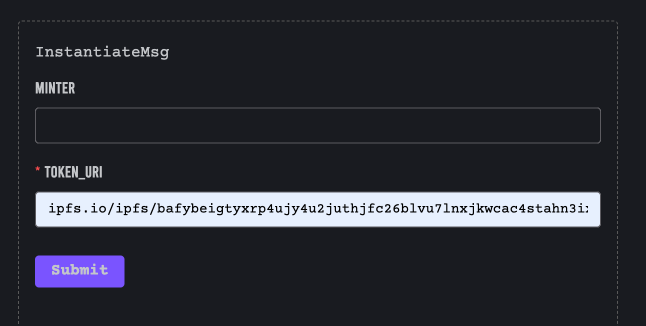
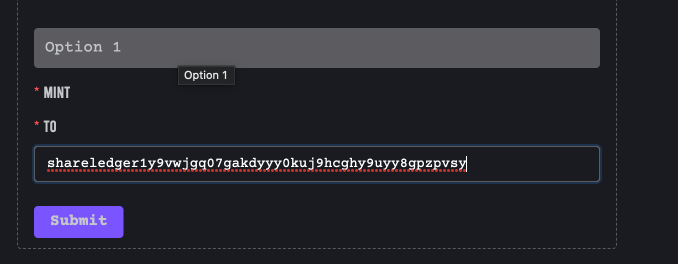
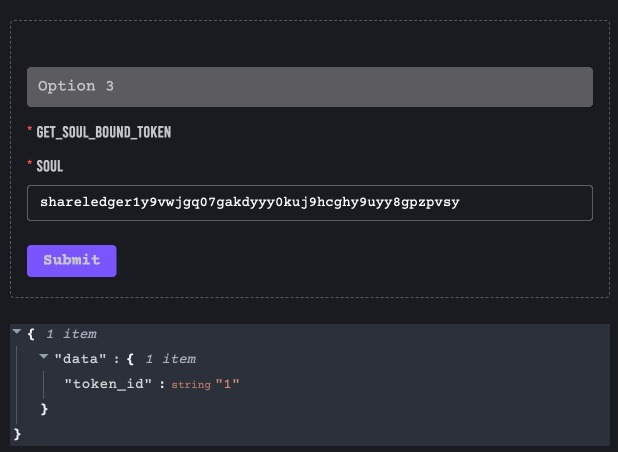

# Soulbound token contract

---

TL;DR

Soulbound Tokens (SBTs) are digital identity tokens that represent the traits, features, and achievements that make up a person or entity. SBTs are issued by “Souls,” which represent blockchain accounts or wallets, and cannot be transferred.

## ShareRing enable CosmWasm

ShareRing is a digital identity blockchain ecosystem, with features that enable you to create and utilise your digital ID in the real world.
CosmWasm is a smart contracting platform built for the Cosmos ecosystem. Simply put, it's the Cosmos (Cosm) way of using WebAssembly (Wasm) hence the name.

### Instantiate Soulbound CosmWasm

People could have multiple wallets (or Souls) representing different parts of their lives. For example, someone could have a “Credentials Soul” for their work history and a “Medical Soul” for their health records. Souls and SBTs would allow people to build a verifiable, digital Web3 reputation based on their past actions and experiences.

You can instantiate multiple soulbound tokens each have different meaning

- minter: is the address that can mint new soulbound token (default value is the address that instantiate contract)
- token_uri: json file describe soulbound token, must be immutable (upload to ipfs, not some centralized server)

```sh
shareledger tx wasm instantiate 1 '{"token_uri": "ipfs.io/ipfs/bafybeigtyxrp4ujy4u2juthjfc26blvu7lnxjkwcac4stahn3ixayhxwe4/9036.json"}' --from authority --label "name service 4" --no-admin -y --gas auto --gas-adjustment 1.3
```

.

### Mint new Soulbound token

Soulbound tokens cannot be bought and sold and are not designed to have market value. Instead, they can be issued by individuals or by another entity to symbolize an accomplishment. The owner of token can't transfer it to other.

Only account with proper permission can mint new token (maybe authority or DAO, multi-sign account)

.

### Example Usage

- Managing medical records
- Storing digital ID cards or memberships
- Certifying achievements, like job history or education
- Verifying attendance to an event, similar to a Proof of Attendance Protocol
- Allowing people to build verifiable, digital reputations based on past actions. This could make it easier to track a user’s decentralized finance (DeFi) borrowing history and give out loans
- Introducing reputation-based voting for decentralized autonomous organization (DAO) governance models. This could also help DAOs mitigate Sybil attacks
- Using social recovery to gain access to an individual’s lost private keys

Binance announced that it would be issuing soulbound tokens on the BNB blockchain to all users who complete know-your-customer (KYC) requirements

Cosm native module or other Cosm contract of any Cosmos blockchain can query from Soulbound contract to verify specific information of users.

```sh
shareledger q wasm contract-state smart shareledger10nav4qmv67qe2eekzdelnxj5fazwmcyrqpzea57wr7c9fyzl00lqduq564 '{"get_soul_bound_token": {"soul":"shareledger1y9vwjgq07gakdyyy0kuj9hcghy9uyy8gpzpvsy"}}'
```

.

### Soulbound contract interface

```Rust
pub enum ExecuteMsg {
    Mint { to: String },
    SetMinter { minter: String },
}

pub enum QueryMsg {
    #[returns(GetTokenURIResponse)]
    GetTokenUri {},
    #[returns(GetInfoResponse)]
    GetInfo {},
    #[returns(GetSoulBoundTokenResponse)]
    GetSoulBoundToken { soul: String },
}

#[cw_serde]
pub struct GetTokenURIResponse {
    pub token_uri: String,
}

#[cw_serde]
pub struct GetInfoResponse {
    pub minter: Addr,
    pub token_uri: String,
    pub owner: Addr,
    pub token_total: Uint128,
}

#[cw_serde]
pub struct GetSoulBoundTokenResponse {
    pub token_id: Uint128,
}
```
